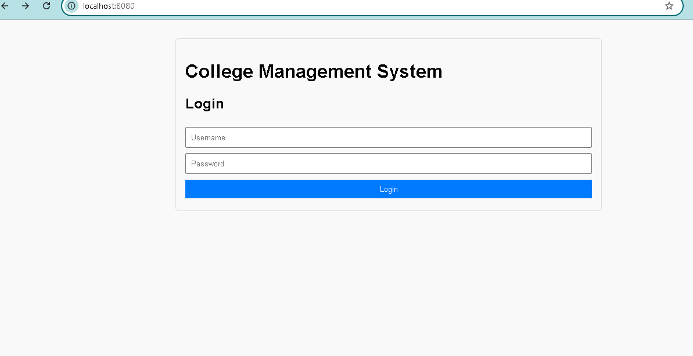
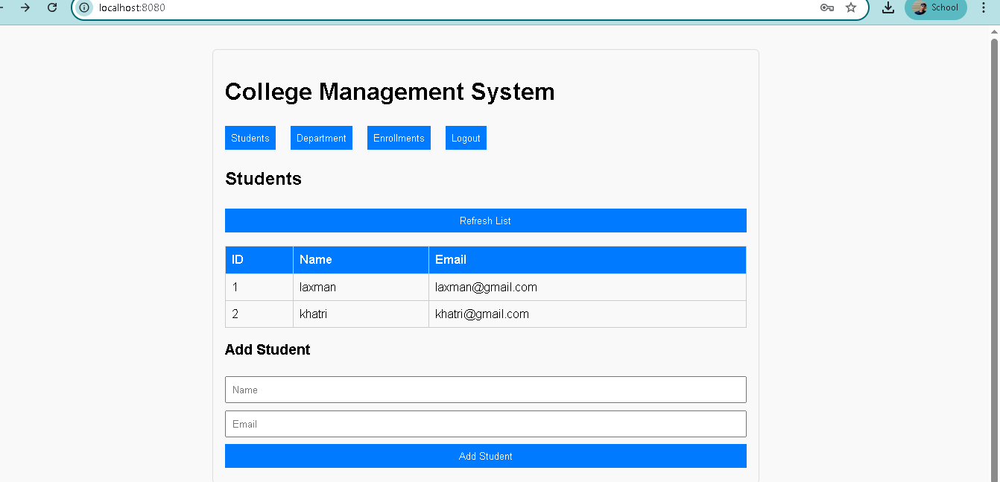
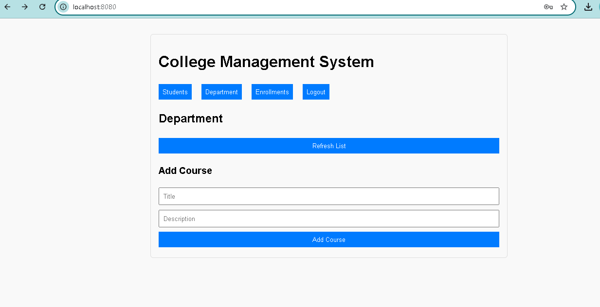
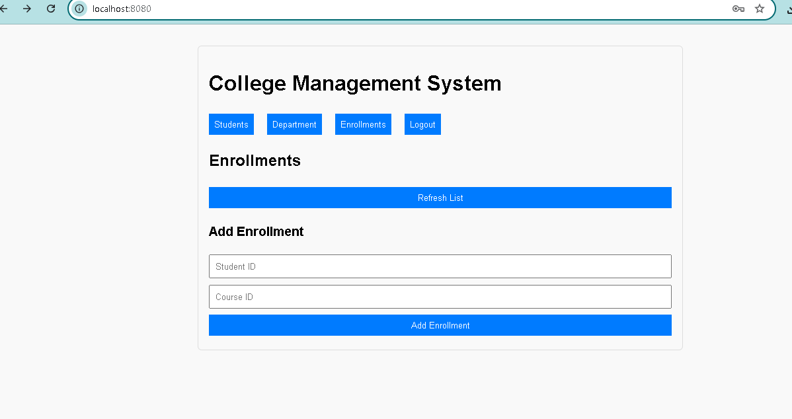

# College Management System

A comprehensive web application to manage **students**, **departments**, and **enrollments** for a college, built with a FastAPI backend and a clean, user-friendly HTML/JavaScript frontend.

---

## Features

- **Secure User Authentication:** Login using OAuth2 with JWT bearer tokens for secure API access.
- **Student Management:** View all students, add new students with their name and email.
- **Department Management:** Browse departments offered by the college, and add new departments with title and description.
- **Enrollment Management:** Manage enrollments by assigning students to departments.
- **Interactive Dashboard:** Dynamic frontend with sections for Students, Departments, and Enrollments — all accessible after login.
- **RESTful API:** Backend exposes clean REST endpoints following modern FastAPI standards.
- **Simple Deployment:** Runs locally or via Docker for seamless deployment.

---

## Technology Stack

- **Backend:** FastAPI (Python), SQLAlchemy ORM, PostgreSQL
- **Frontend:** HTML5, CSS3, Vanilla JavaScript
- **Authentication:** OAuth2 Password flow with JWT tokens
- **Containerization:** Docker, Docker Compose

---

## Setup and Installation

### 🔧 Prerequisites

- Python 3.10+
- PostgreSQL (or use Docker)
- (Optional) Docker & Docker Compose

---

### 💻 Local Backend Setup (without Docker)

1. **Clone the repository**:

   ```bash
   git clone https://github.com/your-username/college-management-system-fastapi.git
   cd college-management-system-fastapi


2. Create and activate a virtual environment:

   ```bash
   python -m venv venv
   source venv/bin/activate   # Linux/macOS
   venv\Scripts\activate      # Windows
   ```

3. Install Python dependencies:

   ```bash
   pip install -r requirements.txt
   ```

4. Configure your database connection in `database.py` or via environment variables.

5. Run the backend server:

   ```bash
   uvicorn main:app --reload
   ```

   The API will be available at `http://localhost:8000`.

# 🐳 Docker Deployment

This will run both FastAPI + PostgreSQL in containers.

1. Build and run using Docker Compose:

   ```bash
   docker-compose up --build
   ```

2. Access the app in your browser:

   ```bash
   http://localhost:8080
   ```

---

### Frontend Setup

- Open the `index.html` file in your browser.
- Ensure the backend is running and accessible at the expected URL (default `http://localhost:8000`).
- Use the login form to authenticate, then access and manage students, departments, and enrollments.

---

## API Endpoints Summary

| Method | Endpoint          | Description                        | Auth Required |
|--------|-------------------|------------------------------------|---------------|
| POST   | `/login`          | Authenticate user, receive token   | No            |
| GET    | `/students`       | List all students                  | Yes           |
| POST   | `/students`       | Add a new student                  | Yes           |
| GET    | `/departments`    | List all departments               | Yes           |
| POST   | `/departments`    | Add a new department               | Yes           |
| GET    | `/enrollments`    | List all enrollments               | Yes           |
| POST   | `/enrollments`    | Add a new enrollment               | Yes           |

---

## How to Use

1. **Login:** Use your username and password to log in. A JWT token will be issued.
2. **Dashboard:** After login, use the navigation buttons to switch between Students, Departments, and Enrollments sections.
3. **View Lists:** Click "Refresh List" to fetch the latest data from the backend API.
4. **Add Records:** Use the forms in each section to add new students, departments, or enrollments.
5. **Logout:** Click the Logout button to clear your session and return to the login screen.

---

## 🔐 Login Credentials (Default for Testing)
Use these credentials to log in:

```
Username: laxman
Password: secret

```
You can change this in the auth.py file.

---

## 📸 Application Preview

Below is a screenshot of the College Management System in action:

This is DashBoaed:



students:




Departments:





Enrollments:




## License

This project is licensed under the MIT License.
